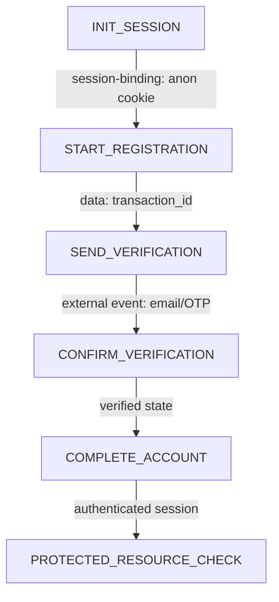

# Templates

复制并按任务裁剪这些模板。所有秘密使用类型占位符，不填写原值。

## 1. Scope and Authorization Record

```markdown
# Scope Record

- Target owner / authorization party:
- Environment: local / dev / test / staging / production
- Allowed hosts/endpoints:
- Allowed accounts/data:
- Allowed actions:
- Prohibited actions:
- Time window:
- Rate limit / concurrency ceiling:
- External side effects allowed?: account creation / email / OTP / resource access
- Stop conditions:
- Evidence retention/deletion rules:
- Approver / reference:
```

## 2. Baseline Run Record

```markdown
# Baseline Run: RUN-001

- Start/end time:
- Browser/client version:
- Profile state: clean / existing
- Test identity alias:
- Initial Cookie/Storage state:
- Final expected state:

| Time | User action | Page/UI state | Key request role | State before | State after | Evidence |
|---|---|---|---|---|---|---|
| | | | | | | |

## Final evidence
- Account created/activated:
- Verification complete:
- Auth session/token established:
- Protected resource accessible:
```

## 3. Endpoint Inventory

```markdown
| ID | Role | Trigger | Method | Host role | Path role | Request type | Pre-state | Inputs | Outputs | Side effect | Dependency | Retry safety | Evidence |
|---|---|---|---|---|---|---|---|---|---|---|---|---|---|
| E01 | INIT_SESSION | page open | GET | identity | /signup | document | INIT | none | session cookie | creates anonymous session | none | conditional | HAR |
```

Role examples：`INIT_SESSION`、`START_REGISTRATION`、`SEND_VERIFICATION`、`CONFIRM_VERIFICATION`、`COMPLETE_ACCOUNT`、`ESTABLISH_SESSION`、`TOKEN_EXCHANGE`、`PROTECTED_RESOURCE_CHECK`。

## 4. Request Dependency Graph



每条边使用：`sequence`、`data`、`session-binding`、`one-time-consumption`、`external-event`、`time-window`、`policy-gate` 或 `optional-branch`。

## 5. Field Dictionary

```markdown
| Canonical name | Observed name | Type/encoding | Source | First seen | Storage | Lifetime | One-time | Session/transaction bound | Used by | Sensitive | Required | Failure signature | Evidence | Confidence |
|---|---|---|---|---|---|---|---|---|---|---|---|---|---|---|
| transaction_id | txn | string | server | E02 response | context memory | transaction | no | yes | E03-E05 | low | yes | 404/409/state error | HAR | observed |
```

常见 Canonical name：

- `anonymous_session`
- `csrf_token`
- `transaction_id`
- `verification_id`
- `otp`
- `oauth_state`
- `oidc_nonce`
- `pkce_verifier` / `pkce_challenge`
- `authorization_code`
- `access_token` / `refresh_token` / `id_token`
- `authenticated_session`
- `challenge_result`

## 6. State Transition Table

```markdown
| Current state | Event | Preconditions | Action/role | Success evidence | Next state | Side effect | Failure state | Retryable | Recovery | Evidence |
|---|---|---|---|---|---|---|---|---|---|---|
| INIT | open entry | network available | INIT_SESSION | Set-Cookie + response | SESSION_READY | anonymous session | FAILED_RETRYABLE | conditional | retry connect | HAR |
```

## 7. State Record

```json
{
  "context_id": "CTX-001",
  "current_state": "VERIFICATION_SENT",
  "last_successful_state": "VERIFICATION_SENT",
  "entered_at": "<TIMESTAMP>",
  "deadline": "<TIMESTAMP>",
  "result_known": true,
  "retry_count": 0,
  "last_error": null
}
```

## 8. Front-End Origin Trace

```markdown
# Field Origin Trace: <FIELD>

- Request role:
- Breakpoint location:
- Payload construction function:
- Call stack summary:
- Source category: user / config / server / random / environment / third-party
- Storage/read location:
- Crypto API used?:
- Transformation/encoding:
- Evidence:
- Confidence:
```

## 9. Differential Experiment

```markdown
# Experiment EXP-001

- Baseline run:
- Hypothesis:
- Single changed variable:
- Everything held constant:
- Expected result:
- Observed HTTP result:
- Observed business result:
- Cookie/token/state delta:
- Side effect:
- Conclusion:
- Evidence grade:
- Reset/revert performed:
```

## 10. Fault Injection Matrix

```markdown
| ID | State | Fault | Expected category | Expected transition | Side-effect risk | Retry expectation | Observed | Request ID | Result |
|---|---|---|---|---|---|---|---|---|---|
| F01 | SESSION_READY | connect timeout | NETWORK_ERROR | remain SESSION_READY | none | limited | | | |
| F02 | COMPLETING | read timeout | NETWORK/SERVER + unknown result | inspect state | high | no immediate retry | | | |
```

最低故障：DNS、connect/read/operation timeout、Cookie/CSRF/token/transaction 缺失或过期、错误/旧 OTP、重复提交、401/403/409/422/429/5xx、Retry-After、Challenge、并发串线。

## 11. Error and Retry Matrix

```markdown
| Error category | Detection | Typical causes | Result known? | Side effect | Retryable | Wait/backoff | Required reset | Recommended action |
|---|---|---|---|---|---|---|---|---|
| RATE_LIMIT_ERROR | 429 | quota/window | yes | varies | conditional | Retry-After | maybe | wait or stop |
```

## 12. Registration Context

```yaml
context_id: CTX-001
run_id: RUN-001
current_state: INIT
last_successful_state: null
overall_deadline: <TIMESTAMP>

session:
  cookie_jar: isolated
  transaction_id: null
  csrf_token: <REDACTED_OR_NULL>

auth_flow:
  oauth_state: <REDACTED_OR_NULL>
  oidc_nonce: <REDACTED_OR_NULL>
  pkce_verifier: <NEVER_LOG>

tokens:
  access: <NEVER_LOG>
  refresh: <NEVER_LOG>
  id: <NEVER_LOG>

verification:
  state: NOT_SENT
  correlation_id: null
  deadline: null

retry_counters: {}
idempotency_keys: {}
request_ids: []
last_error: null
```

## 13. Structured Log Event

```json
{
  "timestamp": "<TIMESTAMP>",
  "run_id": "RUN-001",
  "context_id": "CTX-001",
  "state": "REGISTRATION_STARTED",
  "last_successful_state": "REGISTRATION_STARTED",
  "endpoint_role": "SEND_VERIFICATION",
  "method": "POST",
  "host_role": "identity",
  "path_role": "verification/send",
  "http_status": 429,
  "latency_ms": 120,
  "request_id": "<REQUEST_ID>",
  "error_category": "RATE_LIMIT_ERROR",
  "retry_count": 0,
  "retryable": true,
  "result_known": true,
  "recommended_action": "honor_retry_after"
}
```

## 14. Diagnostic Finding

```markdown
# Finding FND-001

- Title:
- Layer: network / session / identity / business / risk
- Last successful state:
- Failed transition:
- Observed fact:
- Evidence:
- Evidence grade:
- Root-cause layer:
- Impact:
- Result known?:
- Retry safety:
- Recommended recovery:
- Remaining hypothesis:
```

## 15. Minimal Reproduction Record

```markdown
# Minimal Reproduction

## Preconditions
- Environment/authorization:
- Clean context requirements:
- Browser/SDK boundary:

## Steps
| Step | Role | Required inputs | Expected output/state | Side effect | Evidence |
|---|---|---|---|---|---|
| | | | | | |

## Values that must be generated dynamically
- ...

## Steps intentionally retained in browser/official SDK
- ...

## Removed requests/fields and proof of non-necessity
- ...

## Failure and cleanup behavior
- ...
```

## 16. Final Report Skeleton

```markdown
# Identity Flow Analysis Report

## Scope
- Authorization:
- Environment:
- Safety constraints:
- Data handling:

## Executive Summary
- Flow summary:
- Last successful state:
- Main findings:
- Blockers:

## Evidence
- Baseline runs:
- HAR/log/code references:
- Evidence limitations:

## Flow Model
- Endpoint Inventory
- Request Dependency Graph
- Field Dictionary
- State Machine

## Diagnostics
- Error taxonomy
- Root-cause analysis
- Request/Trace IDs
- Recovery paths

## Engineering
- Minimal reproduction / browser boundary
- Architecture and context isolation
- Idempotency/retry/timeout/concurrency
- Secret handling and observability

## Validation
- Differential experiments
- Fault injection
- Final checklist

## Unknowns and Next Actions
- Observed facts:
- Verified findings:
- Strong inferences:
- Hypotheses:
- Remaining risks:
```

## Template Use Rules

- 不填写真实秘密。
- 语义角色与实际 endpoint 分开。
- 每条结论附证据等级。
- 空白字段标记 `unknown` 或 `not observed`，不要猜。
- 对未适用模板说明原因，不静默省略。
- 请求依赖图、字段字典和状态机必须交叉一致。
